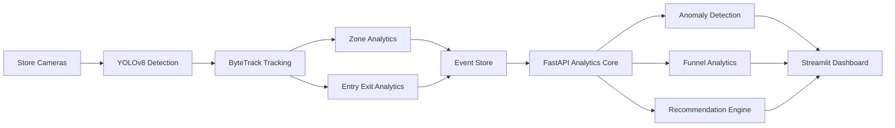
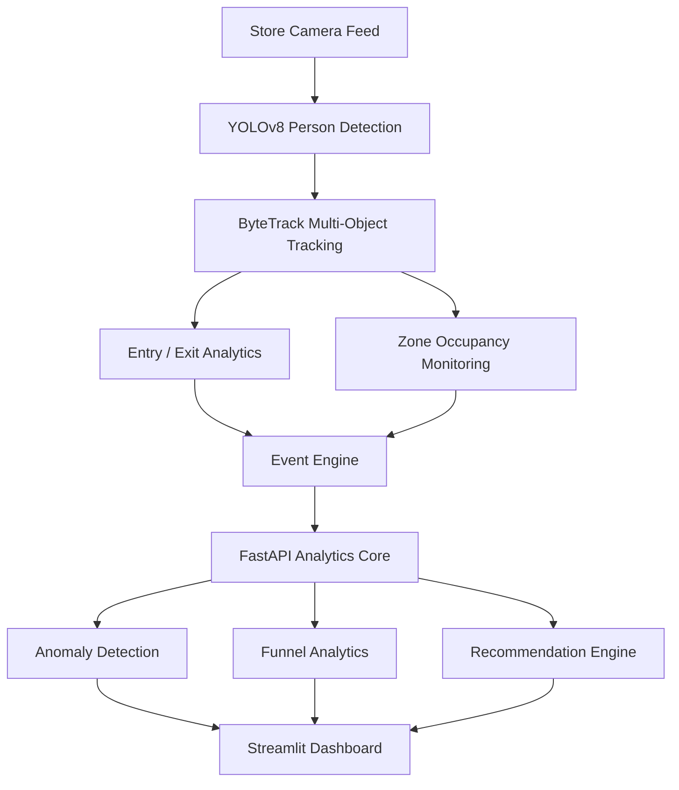
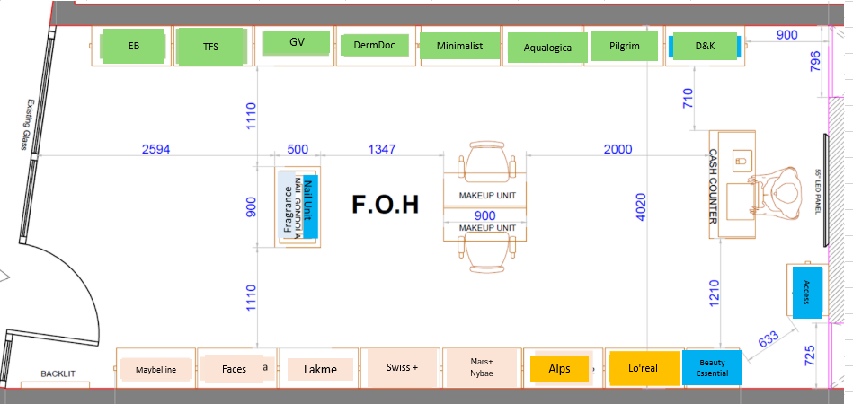

# Purplle Store Intelligence Engine
<p align="center">

<a href="https://store-intelligence-ta.streamlit.app/">
  
</a>

<a href="https://store-intelligence-2a9l.onrender.com/docs">
  
</a>

<a href="https://github.com/Tanmay24-ya/Store-Intelligence">
  
</a>

</p>

## 🚀 Live Deployment

### Live Dashboard
[https://store-intelligence-ta.streamlit.app/](https://store-intelligence-ta.streamlit.app/)

### Backend API Documentation
[https://store-intelligence-2a9l.onrender.com/docs](https://store-intelligence-2a9l.onrender.com/docs)

### Source Code Repository
[https://github.com/Tanmay24-ya/Store-Intelligence](https://github.com/Tanmay24-ya/Store-Intelligence)

---

## 🎯 Overview

**Purplle Store Intelligence Engine** is a full‑stack, production‑grade retail analytics platform that fuses **real‑time computer vision** (YOLOv8 + ByteTrack) with **POS transaction data** to deliver actionable insights for store managers.  The system powers a premium SaaS‑style dashboard built with **Streamlit**, backed by a high‑performance **FastAPI** backend.

---

## 🏗️ System Architecture



* **Camera Feeds** – 3 + RTSP streams (Skincare, Makeup, Entrance)
* **YOLOv8** – Detects people (class 0) in real time.
* **ByteTrack** – Provides persistent IDs for each shopper.
* **Event Engine** – Logs entry/exit, zone occupancy, and timestamps to `events.jsonl`.
* **FastAPI** – Serves cached analytics (`/metrics`, `/anomalies`, `/funnel`, `/recommendations`).
* **Streamlit** – Premium UI with glassmorphism, dark theme, and interactive Plotly charts.

## 🔄 End-to-End Workflow



The workflow illustrates how raw video streams are transformed into actionable retail intelligence through real-time computer vision, event processing, analytics generation, and business intelligence dashboards.

---

## 📈 Business Impact

The **Purplle Store Intelligence Engine** transforms traditional retail stores into intelligent, data-driven environments by combining real-time computer vision analytics with operational intelligence.

Instead of relying on manual observation, store managers gain instant visibility into customer movement, occupancy patterns, engagement levels, and operational bottlenecks through a unified analytics dashboard.

### 🎯 Key Business Benefits

- **Real-Time Occupancy Monitoring** – Track live store occupancy and customer flow.
- **Congestion Detection** – Identify overcrowded zones before customer experience degrades.
- **Operational Visibility** – Gain continuous insight into shopper behavior and store performance.
- **Workforce Optimization** – Allocate staff efficiently based on customer traffic patterns.
- **Data-Driven Merchandising** – Understand which store sections attract the highest engagement.
- **Improved Customer Experience** – Reduce bottlenecks and improve in-store navigation.
- **Actionable Recommendations** – Receive AI-powered suggestions to optimize store operations.

### 📊 Expected Outcomes

| Area | Impact |
|--------|--------|
| Customer Experience | Improved |
| Staffing Efficiency | Increased |
| Operational Visibility | Real-Time |
| Store Utilization | Optimized |
| Decision Making | Data-Driven |
| Congestion Management | Enhanced |
| Revenue Opportunities | Increased |

### 💡 Strategic Value

By transforming raw camera feeds into actionable intelligence, the Store Intelligence Engine enables retail managers to make faster, smarter, and more informed decisions. The platform bridges the gap between physical store activity and business performance, helping retailers optimize operations while delivering a superior shopping experience.

### 🚀 Future Scope

- Heatmap-based shopper movement analysis
- Multi-store analytics and benchmarking
- Predictive footfall forecasting
- AI-powered staffing recommendations
- Real-time customer journey analytics
- Advanced inventory and merchandising intelligence

---

## ✨ Core Features

The **Purplle Store Intelligence Engine** combines real-time computer vision, retail analytics, and business intelligence to provide a comprehensive view of in-store operations and customer behavior.

| Feature | Description | Business Value |
|----------|-------------|----------------|
| **Real-Time Person Detection** | YOLOv8 detects shoppers across multiple camera streams with high accuracy and low latency. | Provides live visibility into store activity. |
| **Multi-Object Tracking** | ByteTrack assigns persistent IDs to shoppers, enabling movement tracking across frames. | Prevents double-counting and enables behavioral analytics. |
| **Entry & Exit Analytics** | Virtual tripwires monitor customer ingress and egress in real time. | Measures store traffic and occupancy trends. |
| **Occupancy Monitoring** | Continuously tracks the number of people present inside the store. | Helps prevent overcrowding and optimize staffing. |
| **Zone Analytics** | Monitors shopper activity across different store sections such as Skincare, Makeup, and Checkout. | Identifies high-engagement and underperforming zones. |
| **Retail Anomaly Center** | Detects unusual patterns such as congestion, sudden traffic spikes, and operational irregularities. | Enables proactive issue resolution. |
| **Advanced Funnel Analytics** | Analyzes the customer journey from store entry to checkout. | Identifies conversion bottlenecks and drop-off points. |
| **AI-Powered Recommendation Engine** | Generates actionable recommendations based on traffic patterns and store performance. | Supports data-driven decision making. |
| **FastAPI Analytics Backend** | Exposes structured analytics through scalable REST APIs. | Enables integration with external systems and dashboards. |
| **Interactive Streamlit Dashboard** | Presents KPIs, trends, alerts, and recommendations through a modern UI. | Delivers actionable insights to store managers. |
| **Camera Intelligence Panel** | Displays processed camera snapshots with tracking overlays and occupancy indicators. | Provides visual verification of analytics. |
| **Event-Driven Analytics Pipeline** | Stores and processes occupancy, entry/exit, and zone events for downstream analytics. | Creates a scalable foundation for future intelligence modules. |

### 📊 Key Performance Metrics

The platform continuously monitors and reports:

- Total Footfall
- Current Occupancy
- Unique Shoppers
- Peak Occupancy
- Average Dwell Time
- Zone-wise Engagement
- Entry vs Exit Trends
- Conversion Funnel Metrics
- Active Alerts & Anomalies
- Revenue & Performance KPIs

### 🎯 Designed For

- Store Managers
- Operations Teams
- Retail Analysts
- Regional Managers
- Business Intelligence Teams
- Customer Experience Teams

---


## 📦 Installation & Setup

```bash
# Clone the repo
git clone https://github.com/Tanmay24-ya/Store-Intelligence.git
cd Store-Intelligence

# Create virtual environment (Windows)
python -m venv venv
venv\Scripts\activate

# Install dependencies
pip install -r requirements.txt

# Download YOLOv8 weights (already included in repo)
# If you need to fetch a newer model:
# pip install ultralytics && yolov8 download yolov8n.pt

# Run the pipeline to generate camera snapshots (optional)
python pipeline/generate_snapshots.py

# Start backend API
uvicorn app.main:app --reload

# In a new terminal, start the dashboard
streamlit run app/dashboard.py
```

The backend will be reachable at `http://127.0.0.1:8000` and the dashboard at `http://127.0.0.1:8501`.

---

## 🔗 API Endpoints (FastAPI)

| Endpoint | Method | Description |
|---|---|---|
| `/health` | GET | Simple health check (`{"status":"ok"}`) |
| `/metrics` | GET | Returns global CV metrics (total tracks, occupancy, etc.) |
| `/anomalies` | GET | List of active alerts with severity |
| `/funnel` | GET | Retail conversion funnel stages and counts |
| `/recommendations` | GET | AI‑generated strategic recommendations |
| `/zone-analytics` | GET | Visitor counts per zone |
| `/events` | GET | Raw CV events (timestamp, camera, type, confidence) |

All responses conform to the Pydantic models defined in `app/schemas.py`.

---


## 🎨 UI Screenshots

### Dashboard Overview
The main command center providing a consolidated view of store performance, shopper activity, occupancy metrics, and business KPIs.


---

### Retail Analytics & KPIs
Comprehensive retail metrics including customer traffic, revenue insights, occupancy trends, and engagement statistics.


---

### Retail Anomaly Center
Real-time anomaly detection system highlighting congestion events, unusual activity, operational risks, and store alerts.


---

### Advanced Funnel Analytics
Customer journey analysis from store entry to checkout, helping identify conversion bottlenecks and drop-off points.


---

### AI-Powered Recommendation Engine
Actionable business recommendations generated by combining computer vision analytics with transaction intelligence.


---

### Multi-Camera Intelligence Panel
Live camera intelligence module showcasing occupancy tracking, shopper movement analysis, and zone monitoring.


---
## 🏬 Store Layout Context

The analytics engine maps computer vision events to real retail zones including:

- Entrance
- Makeup Zone
- Skincare Zone
- Checkout Area
- Brand Gondolas

This spatial mapping enables zone-level engagement analysis, congestion detection, conversion funnel tracking, and merchandising recommendations.



---

## 📄 Documentation

| Document | Description |
|---|---|
| [DESIGN.md](docs/DESIGN.md) | Full system architecture, data flow, and AI decision logic |
| [CHOICES.md](docs/CHOICES.md) | Technology, model, schema, and architecture decision rationale |

---

## 🤝 Contributing


1. Fork the repository.
2. Create a feature branch (`git checkout -b feature/awesome-feature`).
3. Follow the existing code style (type‑hinted, Pydantic‑validated).
4. Run tests (`pytest -q`).
5. Submit a Pull Request.

---

## 📜 License

This project is licensed under the **MIT License** – see the `LICENSE` file for details.

---

## 📞 Contact

* **Owner**: Tanmay24-ya – [GitHub](https://github.com/Tanmay24-ya)
* **Email**: dixittanmay041224@gmail.com

Feel free to open an issue for bugs, feature requests, or documentation improvements.