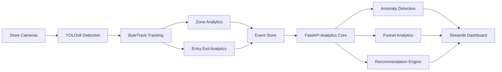

# Purplle Store Intelligence Engine

## 🎯 Overview

**Purplle Store Intelligence Engine** is a full‑stack, production‑grade retail analytics platform that fuses **real‑time computer vision** (YOLOv8 + ByteTrack) with **POS transaction data** to deliver actionable insights for store managers.  The system powers a premium SaaS‑style dashboard built with **Streamlit**, backed by a high‑performance **FastAPI** backend.

---

## 🏗️ System Architecture



* **Camera Feeds** – 3 + RTSP streams (Skincare, Makeup, Entrance)
* **YOLOv8** – Detects people (class 0) in real time.
* **ByteTrack** – Provides persistent IDs for each shopper.
* **Event Engine** – Logs entry/exit, zone occupancy, and timestamps to `events.jsonl`.
* **FastAPI** – Serves cached analytics (`/metrics`, `/anomalies`, `/funnel`, `/recommendations`).
* **Streamlit** – Premium UI with glassmorphism, dark theme, and interactive Plotly charts.

---
## 🔄 End-to-End Workflow

```mermaid
flowchart TD

A[Camera Feed]
--> B[YOLOv8 Person Detection]

B
--> C[ByteTrack Multi Object Tracking]

C
--> D[Entry Exit Counting]

C
--> E[Zone Occupancy Monitoring]

D
--> F[Event Generation]

E
--> F

F
--> G[Analytics Engine]

G
--> H[Anomaly Detection]

G
--> I[Funnel Analytics]

G
--> J[Recommendation Engine]

H --> K[FastAPI]

I --> K

J --> K

K --> L[Streamlit Dashboard]

---

## ✨ Core Features

| Feature | Description | UI Element |
|---|---|---|
| **Retail Anomaly Center** | Detects zone congestion, after‑hours intrusion, low‑engagement dips. | ⚠️ Active Alerts card + severity‑sorted table |
| **Advanced Funnel Analytics** | Stores‑to‑checkout conversion funnel with drop‑off percentages. | 📊 Funnel chart |
| **AI‑Assisted Recommendations** | Cross‑references CV traffic & POS revenue to suggest merchandising actions. | 💡 Recommendation cards |
| **CV Telemetry Metrics** | Unique shoppers, peak occupancy, average dwell time, most active zone. | 📈 Metric cards |
| **Camera Snapshot Panel** | Static snapshots with bounding boxes & tripwire overlay for CAM 1‑3. | 🖼️ Image panels |
| **Revenue & Brand KPIs** | GMV, NMV, transactions, brand contribution, department performance. | 📊 Bar charts |

All emojis have been removed for a professional look.

---

## 📦 Installation & Setup

```bash
# Clone the repo
git clone https://github.com/Tanmay24-ya/Store-Intelligence.git
cd Store-Intelligence

# Create virtual environment (Windows)
python -m venv venv
venv\Scripts\activate

# Install dependencies
pip install -r requirements.txt

# Download YOLOv8 weights (already included in repo)
# If you need to fetch a newer model:
# pip install ultralytics && yolov8 download yolov8n.pt

# Run the pipeline to generate camera snapshots (optional)
python pipeline/generate_snapshots.py

# Start backend API
uvicorn app.main:app --reload

# In a new terminal, start the dashboard
streamlit run app/dashboard.py
```

The backend will be reachable at `http://127.0.0.1:8000` and the dashboard at `http://127.0.0.1:8501`.

---

## 🔗 API Endpoints (FastAPI)

| Endpoint | Method | Description |
|---|---|---|
| `/health` | GET | Simple health check (`{"status":"ok"}`) |
| `/metrics` | GET | Returns global CV metrics (total tracks, occupancy, etc.) |
| `/anomalies` | GET | List of active alerts with severity |
| `/funnel` | GET | Retail conversion funnel stages and counts |
| `/recommendations` | GET | AI‑generated strategic recommendations |
| `/zone-analytics` | GET | Visitor counts per zone |
| `/events` | GET | Raw CV events (timestamp, camera, type, confidence) |

All responses conform to the Pydantic models defined in `app/schemas.py`.

---


## 🎨 UI Screenshots

### Dashboard Overview
The main command center providing a consolidated view of store performance, shopper activity, occupancy metrics, and business KPIs.


---

### Retail Analytics & KPIs
Comprehensive retail metrics including customer traffic, revenue insights, occupancy trends, and engagement statistics.


---

### Retail Anomaly Center
Real-time anomaly detection system highlighting congestion events, unusual activity, operational risks, and store alerts.


---

### Advanced Funnel Analytics
Customer journey analysis from store entry to checkout, helping identify conversion bottlenecks and drop-off points.


---

### AI-Powered Recommendation Engine
Actionable business recommendations generated by combining computer vision analytics with transaction intelligence.


---

### Multi-Camera Intelligence Panel
Live camera intelligence module showcasing occupancy tracking, shopper movement analysis, and zone monitoring.


---

## 🤝 Contributing

1. Fork the repository.
2. Create a feature branch (`git checkout -b feature/awesome-feature`).
3. Follow the existing code style (type‑hinted, Pydantic‑validated).
4. Run tests (`pytest -q`).
5. Submit a Pull Request.

---

## 📜 License

This project is licensed under the **MIT License** – see the `LICENSE` file for details.

---

## 📞 Contact

* **Owner**: Tanmay24-ya – [GitHub](https://github.com/Tanmay24-ya)
* **Email**: dixittanmay041224@gmail.com

Feel free to open an issue for bugs, feature requests, or documentation improvements.