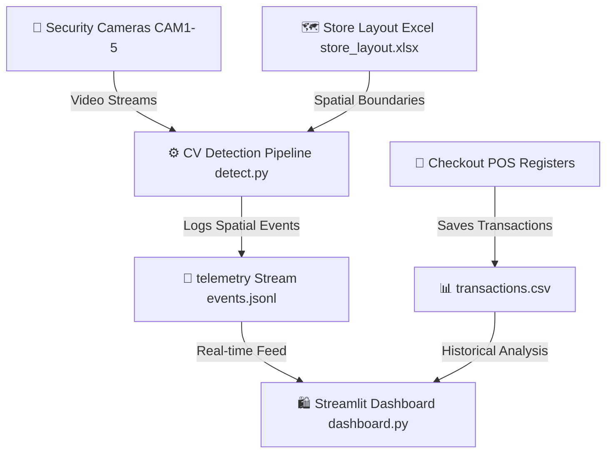

# Store Intelligence - Documentation Portal

Welcome to the **Store Intelligence** architecture documentation portal. This system is designed as a modular, production-ready computer vision and data intelligence pipeline to analyze shopper behavior, optimize store layouts, and coordinate telemetry feeds with POS retail operations.

---

## 🏗️ System Architecture



The system operates across three primary stages:
1. **Ingestion & Tracking**: Security camera feeds (`CAM1.mp4` through `CAM5.mp4`) are fed into the YOLOv8 tracking pipeline.
2. **Behavioral Event Extraction**: Shoppers are detected as bounding boxes, normalized into spatial coordinate grids, and mapped against coordinates in `store_layout.xlsx` to detect entry, departures, and dwell-times inside specific zones.
3. **Data Fusion & Presentation**: Spatial tracking data is combined with POS sales registers to deliver live analytics on conversion ratios, aisle traffic velocities, and cart ticket values.

---

## 📊 Data Specifications & Schemas

### 1. `store_layout.xlsx` (Spatial Zones mapping)
A spreadsheet detailing spatial coordinate boxes bounding physical locations of the store.
- **Zone_ID**: Unique key (e.g., `Z1`, `Z2`)
- **Zone_Name**: Label of area (e.g., `Bakery & Dairy`)
- **Camera_Coverage**: List of CAM feeds covering the zone
- **X_Min, Y_Min, X_Max, Y_Max**: Percentage-scaled coordinates (0 to 100) within the camera frame defining the rectangular area of interest.

### 2. `events.jsonl` (Computer Vision Telemetry)
A raw line-delimited JSON stream capturing atomic visitor telemetry.
```json
{
  "timestamp": "2026-05-30T10:15:30Z",
  "camera": "CAM1",
  "event_type": "customer_entry",
  "confidence": 0.98,
  "details": {"customer_id": "C_101", "direction": "inbound"}
}
```

### 3. `transactions.csv` (Point of Sales Ledger)
A standard retail transactional database recording physical ledger records.
- **transaction_id**: Unique purchase receipt index
- **timestamp**: ISO 8601 transaction date and time
- **customer_id**: Shopper index linked to CRM
- **items**: JSON block containing itemized prices and quantities purchased
- **total_amount**: Gross ticket checkout price
- **payment_method**: Cash, Credit Card, or Mobile Pay.

---

## 🛠️ Step-by-Step Setup Guide

### Step 1: Install Requirements
Ensure your Python environment is set up. Check requirements:
```bash
pip install -r requirements.txt
```

### Step 2: Feed Video Streams
Place video recordings corresponding to `CAM1.mp4` through `CAM5.mp4` inside the `data/videos/` directory.

### Step 3: Run the Computer Vision Tracker
Execute the main tracker to scan the video feeds and write shopper telemetry logs:
```bash
python pipeline/detect.py
```

### Step 4: Run the Analytics Dashboard
View spatial dwell times and transactional sales velocity:
```bash
streamlit run app/dashboard.py
```
